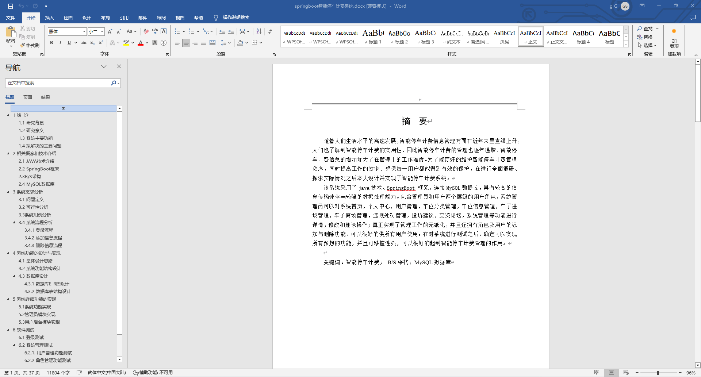
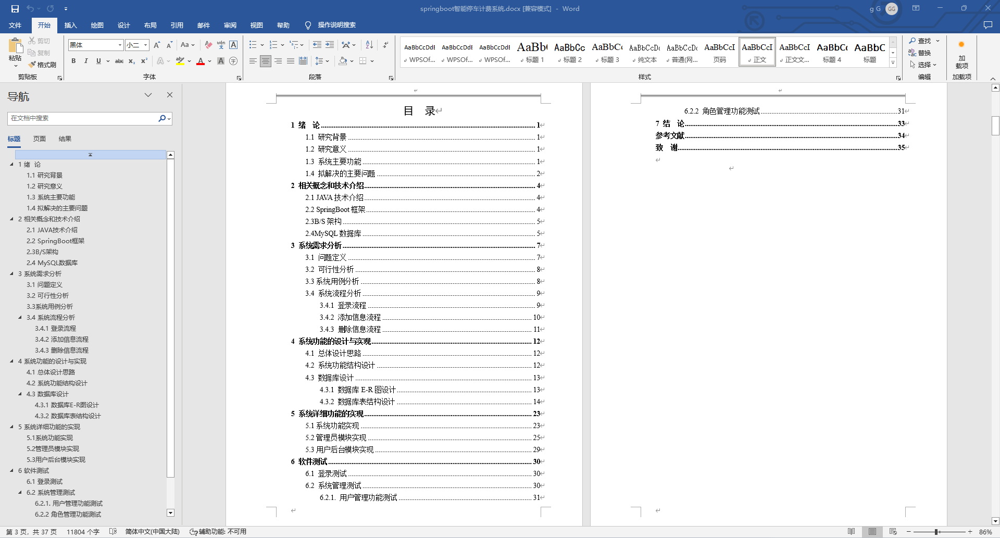
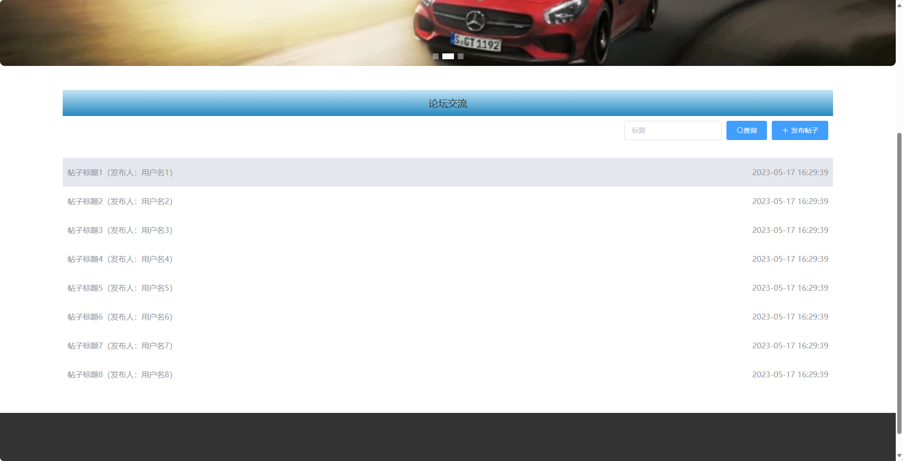
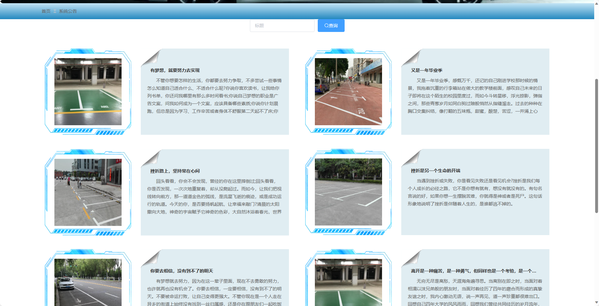
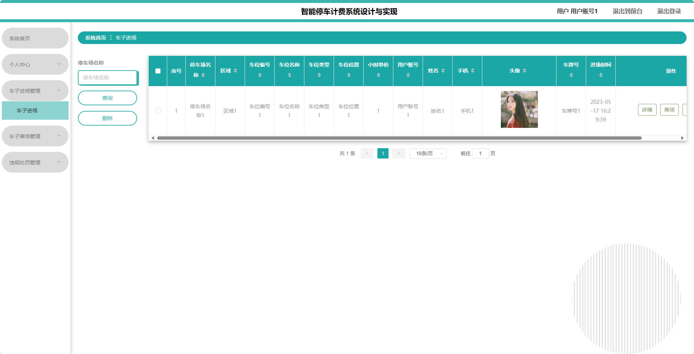
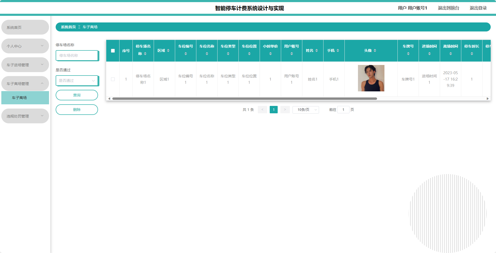
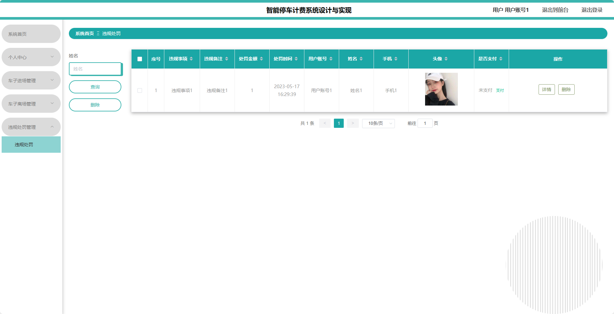
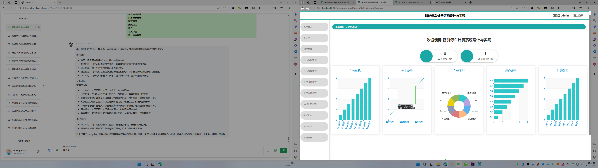
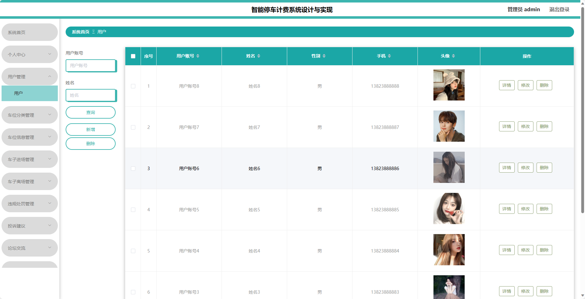

基于SpringBoot的智能停车计费系统（程序+论文）
=
- 完整代码获取地址：从戎源码网 ([https://armycodes.com/](https://armycodes.com/))
- 作者微信：19941326836  QQ：952045282 
- 承接计算机毕业设计、Java毕业设计、Python毕业设计、深度学习、机器学习
- 选题+开题报告+任务书+程序定制+安装调试+论文+答辩ppt 一条龙服务
- 所有选题地址https://github.com/nature924/allProject

一、项目介绍
---
基于Spring Boot框架实现的智能停车计费系统，系统包含两种角色：管理员、用户,系统分为前台和后台两大模块，主要功能如下。

### 前台模块：
- 首页：展示平台的最新动态、车位信息等内容。
- 车位信息：用户可以查看各类车位的位置、空闲情况、停车费用及限制条件等信息。
- 论坛交流：用户可以在论坛上进行交流。
- 公告：展示平台发布的公告和通知信息。
- 投诉建议：用户可以在投诉建议板块上对停车场内发生的问题或提出改进意见。
- 在线交流：用户可以通过在线聊天室与管理人员进行在线咨询。
- 个人中心：用户可以管理个人信息，包括修改密码、查看停车历史等。

### 后台模块：
### 管理员角色：
- 个人中心：管理员可以管理个人信息，修改密码等。
- 用户管理：管理员可以管理用户信息，包括添加、编辑和删除用户信息。
- 车位分类管理：管理员可以管理车位分类信息，包括添加、编辑和删除分类。
- 车位信息管理：管理员可以管理车位的信息，包括添加、编辑和删除车位。
- 车子进场管理：管理员可以管理车辆进场情况，包括车牌号、进场时间、停车位置等信息。
- 车子离场管理：管理员可以管理车辆离场情况，包括车牌号、离场时间、停车费用等信息。
- 违规处罚管理：管理员可以管理停车场内的违规行为，包括违停、乱扔垃圾等。
- 投诉建议：管理员可以管理投诉建议板块，包括处理投诉、回复用户等。
- 论坛交流：管理员可以管理论坛板块，包括审核话题、回复用户等。
- 系统管理：管理员可以管理系统的相关配置，包括日志管理、权限管理等。

### 用户角色：
- 个人中心：用户可以管理个人信息，包括修改密码、查看停车历史等。
- 车子进场管理：用户可以登记车辆进场信息，包括车牌号、进场时间等。
- 车子离场管理：用户可以登记车辆离场信息，包括车牌号、离场时间等。
- 违规处罚管理：用户可以查看自己的违规记录及相应处罚情况。

二、项目技术
---
- 编程语言：Java
- 数据库：MySQL
- 项目管理工具：Maven
- 前端技术：VUE、HTML、Jquery、Bootstrap
- 后端技术：Spring、SpringMVC、MyBatis

三、运行环境
---
- 操作系统：Windows、macOS都可以
- JDK版本：JDK1.8以上都可以
- 开发工具：IDEA、Ecplise、Myecplise都可以
- 数据库: MySQL5.7以上都可以
- Tomcat：任意版本都可以
- Maven：任意版本都可以

四、运行截图
---
### 论文截图：

### 程序截图：

